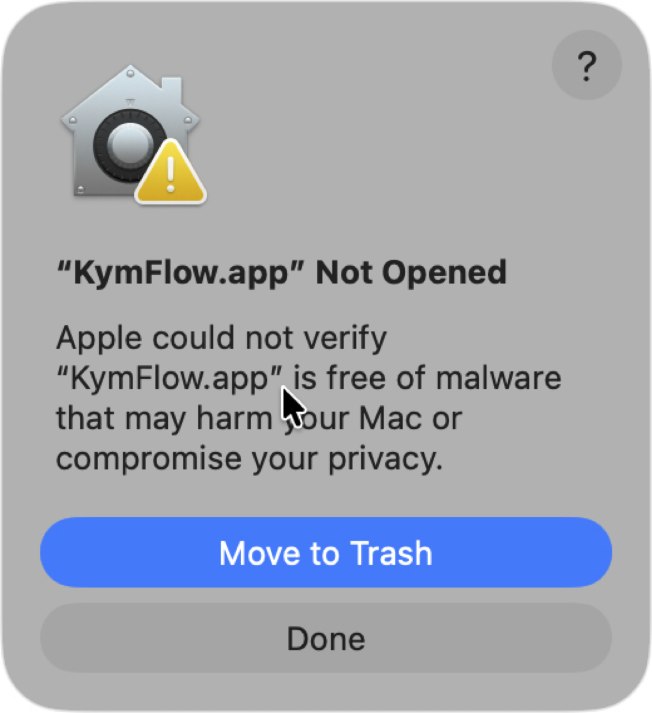

## Initial install

 1. grab the kymflow.app.zip off box
 2. grab the declan-stall-v1.zip off box
 3. uncompress both files

Always work locally, **DO NOT** work on files that are on box.

 We will be working in the raw data folder you just unzipped, `declan-stall-v1/`.

 All your work will be saved into `declan-stall-v1/`. You can then zip the entire folder and put it back on box for me to analyze the results. **Important** when putting the new declan-stall-v1.zip on box, be sure to put it into a **new folder**, do not replace the original declan-stall-v1.zip on box.

Now that you have a local copy of `declan-stall-v1/`. Run the KymFlow app ...

## First time run of KymFlow app

{.img-small align=right }

The first time you run the kymflow app you need to do this.

 - [[[THIS NO LONGER WORKS]]] Option + Right-click (or Control + Click) on KymFlow.app and select 'Open' from the context menu

This gets you around the initial warning of "KymFlow.app Not opened".

### Do this

 1. Download the zip into your Downloads folder
 2. Double-click the KymFlow.zip to extract KymFlow.app
 2. Open a terminal window and type (copy and paste this to get it correct)
 
```
   xattr -dr com.apple.quarantine ~/Downloads/KymFlow.app
```

After that little hoop, the app should run normally.

If you have any problems with this, email and I will get back asap. This is a one time 'first run' thing. Next time you open (double-click), this is not needed.


## Once the KymFlow app is running ...

Click 'open csv', find you local `declan-stall-v1/` folder and open the provided `declan-random-v1.csv`

This will populate KymFlow with 50 files for scoring.

!!! critical "We are loading and analyzing a random subset of tif files specified in `declan-random-v1.csv`"
    You need to use 'Open CSV' and then insure you are looking at a list of 50 tif files.

The main window will look like this:

{.img-large }

## On top is a table/list of all tif files.

Single click a file will:

 - Display the kym image (gray)
 - Display its radon velocity analysis (red)
 - Populate the 'kym events'. In this example there are two 'kym events' shown in the lower table

## To add your own `User Added` events that will represent a stall:

  - Zoom in on the kymograph/velocity plot (mouse click + drag)
  - Click 'Add Event' -> select the start/stop time of the event visually (again with a click+drag in the kymograph/velocity plot)
  - You will then see your new 'User Event' in the event list. User events are displayed in the velocity plot as yellow rectangles.
  - The evnts you add will have `Type` 'User Added'
  - You can further classify your 'User Added' events by a double-click on 'User Type' and select from: unreviewed, true_stall, reversal, other.


{.img-large }

## Some GUI niceties

 - Keyboard `enter` will always set the view to full scale. You can also double-click on the plot to set full scale.
 - When you are zoomed in, use the '<' and '>' buttons to scroll throught the kymograph.

## Blind analysis

To turn on blind analysis. Go to the options toolbar, by clicking the gear icon in the left toolbar. Click on the 'Blinded Analysis' checkbox.

**Important.** Blinded analysis is a honesty contract. The gui will in general blind your analysis by not showing filenames, dates, treatments, conditions, etc. There are plenty of ways around it. Be honest!!!


## Always save your work

As you add user events, the top table of files will show which have been edited with a red X. 

Save all your work with 'Save All' button.

When you quit KymFlow, you will see a warning "Do you really want to quit?".

If you still need to save, click Cancel, save your work, and then quit again.

{.img-small }

## What is next

This is just the first step.

Score all 50 files in `declan-stall-v1/` `declan-random-v1.csv`. Zip the `declan-stall-v1/` and put the zip into a new folder on box.

I have scripts to test the null hypothesis, 'number of stalls is significantly different between condiitons`.

This little tutorial is really the beginning of a lot of fun with GUIs. There is a ton more but I will leave it at that for now.