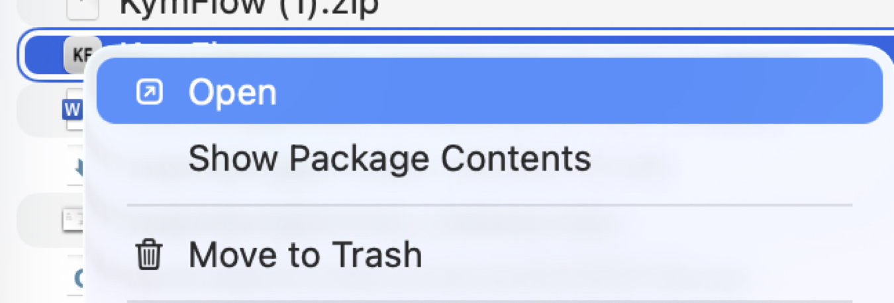

# Download KymFlow

KymFlow is available as a one-click desktop application for macOS.

## System Requirements

- **macOS**: 10.13 (High Sierra) or later
- **Architecture**: Apple Silicon (ARM)

## Download

<!-- Download the latest release from the [GitHub Releases page](https://github.com/mapmanager/kymflow/releases). -->

Robert will provide you with a download link ...

The macOS application is provided as a `.zip` file containing `KymFlow.app`.

## Running the KymFlow app (macOS)

### Step 1: Download and Extract

1. Download the `KymFlow.app.zip` file.
2. Uncompress the zip file (double-click)
3. You should now have a `KymFlow.app` macOS app

### Step 2: Run the Application (First Time)

macOS may show a warning about an "unknown developer" when you first try to open the app. This is normal for applications that aren't signed with an Apple Developer certificate. To run KymFlow:

1. **Option + Right-click** (or Control + Click) on `KymFlow.app`
2. Select **"Open"** from the context menu
3. You will see a warning dialog saying "KymFlow is from an unidentified developer"
4. Click **"Open"** in the warning dialog
5. The application will launch

!!! note "First Time Only"
    You only need to do this once. After the first time, you can double-click `KymFlow.app` normally and it will open without any warnings.

When you double-click the downloaded app, if you see this

{.img-small }

Try these two things:

1. option + double-click the app

or

2. option + right-click the app and select 'Open...'

{.img-small }

