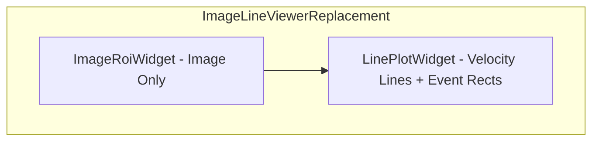

# Plan: Switch Kymflow to Nicewidgets Image Line Widget

## Resolved Decisions (from Steering)

- **ImageRoiWidget** is image-only; `add_line` API will not be used. Velocity lines are displayed by **LinePlotWidget** only, below the image.
- **ImageRoiWidget** is the source of truth for ROI selection. Show its ROI toolbar and ROI rectangles. During transition, ignore the existing analysis toolbar ROI `ui.select`; ROI selection is entirely driven by ImageRoiWidget signals.
- **LinePlotControlsView** (drawer): Lower priority. Defer incorporating events to/from [line_plot_controls_view.py](kymflow/src/kymflow/gui_v2/views/line_plot_controls_view.py) and [line_plot_controls_bindings.py](kymflow/src/kymflow/gui_v2/views/line_plot_controls_bindings.py) until after migration.
- **Plot pool**: Does not depend on `plot_image_line_plotly_v3` or ImageLineViewerView. No action needed.
- **Analysis toolbar ROI dropdown**: Leave visible but ignored during transition.
- **ROI edit flow**: Use ImageRoiWidget's built-in edit flow only; no external "Edit ROI" trigger.
- **LinePlotControlsView (drawer)**: Keep controls visible; `apply_filters` and `reset_zoom` no-op until wired post-migration.

---

## Pre-Plan Changes to nicewidgets/

These changes should be made in nicewidgets before or during the kymflow migration.

### ImageRoiWidget ([image_roi_widget.py](nicewidgets/src/nicewidgets/image_line_widget/image_roi_widget.py))

| Change | Description |
|--------|-------------|
| **Theme support** | Add dark/light theme support. Constructor or setter to configure `paper_bgcolor`, `plot_bgcolor`, `font` color, grid colors (similar to kymflow `ThemeMode.DARK` / `ThemeMode.LIGHT`). |
| **set_colorscale / set_contrast** | Add `set_colorscale(name)` and `set_contrast(zmin=None, zmax=None)` to update heatmap colorscale and zmin/zmax without rebuilding the full plot. |

### LinePlotWidget ([line_plot_widget.py](nicewidgets/src/nicewidgets/image_line_widget/line_plot_widget.py))

| Change | Description |
|--------|-------------|
| **Theme support** | Add dark/light theme support (matching ImageRoiWidget). |
| **Add-user-event API** | Add API to enable draw-rect mode; when user draws a rect on the line plot, invoke callback with `(x0, x1)` or equivalent. Required for "Set Range" and "Add Event" flows. Can be added post-swap as a follow-up if needed. |

---

## Implementation Plan: Pre-Plan Changes (nicewidgets)

This section specifies file changes and API shapes for the pre-plan. Run `cd nicewidgets && uv run python src/nicewidgets/image_line_widget/image_roi_widget_demo_app.py` to validate after changes.

### A. Shared Theme Module (new file)

**File**: `nicewidgets/src/nicewidgets/image_line_widget/theme.py` (new)

**Purpose**: Shared theme enum and helpers, compatible with kymflow `ThemeMode` semantics.

**API shape**:

```python
from enum import Enum

class ThemeMode(str, Enum):
    DARK = "dark"
    LIGHT = "light"

def get_theme_template(theme: ThemeMode) -> str:
    """Returns 'plotly_dark' or 'plotly_white'."""

def get_theme_colors(theme: ThemeMode) -> tuple[str, str]:
    """Returns (bg_color, fg_color) as hex strings."""
```

- `get_theme_template`: DARK → `"plotly_dark"`, LIGHT → `"plotly_white"`
- `get_theme_colors`: DARK → `("#000000", "#ffffff")`, LIGHT → `("#ffffff", "#000000")` (matching kymflow)

---

### B. ImageRoiWidget Changes

**File**: `nicewidgets/src/nicewidgets/image_line_widget/image_roi_config.py`

**Changes**:
1. Add optional `theme: Optional[ThemeMode] = None` to `ViewGenerator.full_build()`.
2. If `theme` is provided, set `layout["template"] = get_theme_template(theme)` instead of hardcoded `"plotly_dark"`.
3. If `theme` is None, keep current behavior: `layout["template"] = "plotly_dark"`.

**File**: `nicewidgets/src/nicewidgets/image_line_widget/image_roi_widget.py`

**Changes**:
1. Import `ThemeMode`, `get_theme_template` from `theme.py`.
2. Add optional constructor arg: `theme: ThemeMode | str | None = None` (accept `"dark"`/`"light"` or enum).
3. Store `self._theme: ThemeMode` (normalize to enum; default `ThemeMode.DARK` for backwards compatibility).
4. Pass `theme` to `ViewGenerator.full_build()` in `__init__`, `set_file()`, and `_change_channel()`.
5. Add `set_theme(self, theme: ThemeMode | str) -> None`: update `_theme`, set `plot_dict["layout"]["template"] = get_theme_template(theme)`, call `self.plot.update_figure(self.plot_dict)`.
6. Add `set_colorscale(self, name: str) -> None`: find heatmap trace (`plot_dict["data"][0]`), set `trace["colorscale"] = _resolve_colorscale(name)`, call `plot.update_figure(plot_dict)`. Handle `"inverted_grays"` → custom list; else pass name as-is.
7. Add `set_contrast(self, zmin: int | None = None, zmax: int | None = None) -> None`: update heatmap trace `zmin`/`zmax`; omit keys if None; call `plot.update_figure(plot_dict)`.
8. Add helper `_resolve_colorscale(name: str)` in widget or a small util: return list for `"inverted_grays"`, else return name.

---

### C. LinePlotWidget Changes

**File**: `nicewidgets/src/nicewidgets/image_line_widget/line_plot_widget.py`

**Changes**:
1. Import `ThemeMode`, `get_theme_template` from `theme.py`.
2. Add optional constructor arg: `theme: ThemeMode | str | None = None`.
3. Store `self._theme: ThemeMode` (default `ThemeMode.DARK`).
4. In `_layout_base()` or constructor: add `theme` param; set `layout["template"] = get_theme_template(theme) if theme else "plotly_dark"`.
5. Add `set_theme(self, theme: ThemeMode | str) -> None`: update `_theme`, set `plot_dict["layout"]["template"]`, call `self.plot.update_figure(self.plot_dict)`.

**Note**: `_layout_base` is a module-level function. Prefer: set `layout["template"]` in `LinePlotWidget.__init__` after calling `_layout_base()`, so theme is applied without changing `_layout_base` signature.

---

### D. Colorscale Resolution for set_colorscale

**Option 1 (self-contained in nicewidgets)**: Add `_resolve_colorscale(name: str)` in `image_roi_widget.py`:

```python
def _resolve_colorscale(name: str):
    if name == "inverted_grays":
        return [[0, "rgb(255,255,255)"], [1, "rgb(0,0,0)"]]
    return name  # Plotly built-in names
```

**Option 2**: Add `nicewidgets/image_line_widget/colorscales.py` with `get_colorscale(name) -> str | list` (mirror kymflow’s approach). Keeps colorscale logic reusable.

**Recommendation**: Option 1 for minimal new files; Option 2 if we expect more colorscale logic later.

---

### E. Demo App Update

**File**: `nicewidgets/src/nicewidgets/image_line_widget/image_roi_widget_demo_app.py`

**Changes** (optional, for validation):
- Pass `theme=ThemeMode.LIGHT` or `theme=ThemeMode.DARK` to one or both widgets to verify theme switching.
- Optionally add a toggle button that calls `image_roi_plot.set_theme(ThemeMode.LIGHT)` / `set_theme(ThemeMode.DARK)` and `line_plot.set_theme(...)`.
- Optionally call `image_roi_plot.set_colorscale("Viridis")` and `set_contrast(zmin=10, zmax=200)` to exercise new APIs.

---

### F. Files Touched Summary

| File | Action |
|------|--------|
| `nicewidgets/src/nicewidgets/image_line_widget/theme.py` | Create |
| `nicewidgets/src/nicewidgets/image_line_widget/image_roi_config.py` | Modify: add `theme` to `full_build` |
| `nicewidgets/src/nicewidgets/image_line_widget/image_roi_widget.py` | Modify: `theme` arg, `set_theme`, `set_colorscale`, `set_contrast` |
| `nicewidgets/src/nicewidgets/image_line_widget/line_plot_widget.py` | Modify: `theme` arg, `set_theme` |
| `nicewidgets/src/nicewidgets/image_line_widget/image_roi_widget_demo_app.py` | Optional: add theme/contrast demo |

---

### G. Backwards Compatibility

- `theme=None` preserves current behavior (dark).
- New methods `set_theme`, `set_colorscale`, `set_contrast` are additive.
- No changes to `on_roi_event`, `on_axis_change`, or other existing APIs.

---

### H. Validation

1. Run: `cd nicewidgets && uv run python src/nicewidgets/image_line_widget/image_roi_widget_demo_app.py`
2. Confirm ImageRoiWidget and LinePlotWidget render.
3. Test `set_theme` (if demo includes toggle).
4. Test `set_colorscale` and `set_contrast` on ImageRoiWidget.

---

## 1. Overview of Current kymflow gui_v2 MVC Architecture

### 1.1 Structure

- **Models**: `AppState` (selected_file, selected_roi_id, theme, image_display_params), `KymImage`, `KymAnalysis`, `VelocityEvent`, `RoiBounds`
- **Views**: [folder_selector_view.py](kymflow/src/kymflow/gui_v2/views/folder_selector_view.py), [file_table_view.py](kymflow/src/kymflow/gui_v2/views/file_table_view.py), [image_line_viewer_view.py](kymflow/src/kymflow/gui_v2/views/image_line_viewer_view.py), [kym_event_view.py](kymflow/src/kymflow/gui_v2/views/kym_event_view.py), [line_plot_controls_view.py](kymflow/src/kymflow/gui_v2/views/line_plot_controls_view.py), [contrast_view.py](kymflow/src/kymflow/gui_v2/views/contrast_view.py), [drawer_view.py](kymflow/src/kymflow/gui_v2/views/drawer_view.py)
- **Bindings**: Each view has a corresponding `*_bindings.py` that subscribes to EventBus and calls view methods
- **Controllers**: FileSelectionController, ROISelectionController, EventSelectionController, KymEventRangeStateController, RoiEditStateController, EditRoiController, ImageDisplayController, etc.
- **Event flow**: Intent events → controllers → AppState → bridge → state events → bindings → view updates

### 1.2 Current ImageLineViewerView Architecture

- **Implementation**: Single `ui.plotly` with `plot_image_line_plotly_v3()` producing a 2-row subplot (image + velocity line)
- **State**: `_current_file`, `_current_roi_id`, `_theme`, `_display_params`, filter state, `_selected_event_id`, `_event_filter`, ROI edit state
- **Events emitted**: `SetKymEventXRange`, `SetRoiBounds`
- **Events consumed**: `FileSelection`, `ROISelection`, `EventSelection`, `ThemeChanged`, `ImageDisplayChange`, `SetKymEventRangeState`, `SetRoiEditState`, `VelocityEventUpdate`, `AddKymEvent`, `DeleteKymEvent`, `EditRoi`, `DeleteRoi`, `DetectEvents`, `AnalysisCompleted`, `EditPhysicalUnits`, `KymScrollXEvent`

### 1.3 Target Architecture After Migration



- **ImageRoiWidget**: Kymograph heatmap + ROI toolbar + ROI rectangles. Source of truth for ROI selection. No velocity line.
- **LinePlotWidget**: Velocity line + AcqImageEventManager (event rects). Velocity lines only.

---

## 2. ROI Selection Flow (Post-Migration)

- **ImageRoiWidget** emits `ROIEvent(SELECT)` when user selects an ROI in its toolbar.
- **ImageLineViewerReplacementBindings** listens to `on_roi_event` and emits kymflow `ROISelection(phase="intent", roi_id=...)` to update AppState.
- The existing analysis toolbar ROI `ui.select` is ignored during transition; all ROI selection comes from ImageRoiWidget.
- **Mapping**: Adapter must use ROI names that map 1:1 to kymflow `roi_id` (e.g. `"ROI_0"` → 0) so bindings can emit correct `roi_id` in `ROISelection`.

---

## 3. Nicewidgets APIs (Summary)

### 3.1 ImageRoiWidget

- **Constructor**: `widget_name`, `manager: ChannelManager`, `config`, `initial_rois`, `on_roi_event`, `on_axis_change`
- **Methods**: `set_file`, `select_roi_by_name`, `set_toolbar_visible`, `set_rois_visible`, `set_x_axis_range`, `set_x_axis_autorange`, `add_line` (not used in migration), etc.
- **Emits**: `ROIEvent` (add/delete/update/select), `AxisEvent`
- **Usage in kymflow**: Image only; do not use `add_line`.

### 3.2 LinePlotWidget

- **Constructor**: `widget_name`, `x`, `y`, `name`, `x_label`, `y_label`, `cfg`, `on_axis_change`
- **AcqImageEventManager**: `add_events`, `select_event`, `update_event`, `clear_event`, `clear_all_events`
- **Emits**: `AxisEvent`
- **Usage in kymflow**: Velocity lines and event rects only.

---

## 4. Data Model Mapping

| kymflow | nicewidgets |
|---------|-------------|
| `KymImage` | `ChannelManager` with `Channel` from `kf.get_img_slice(channel=1)` |
| `KymImage.rois` / `RoiBounds` | `RegionOfInterest(name, r0, r1, c0, c1)` via adapter |
| `KymAnalysis.get_analysis_value(roi_id, "velocity", ...)` | `LinePlotWidget.add_line` / `update_line` |
| `VelocityEvent` | `AcqImageEvent(start_t, stop_t, event_type, user_type, event_id)` |
| `ImageDisplayParams` | `ImageRoiConfig` / `set_colorscale`, `set_contrast` (pre-plan) |

---

## 5. Step-by-Step Migration Strategy

**Validation after each phase**: Run `cd kymflow && uv run pytest tests/` to confirm no regressions. Add or update unit tests as specified for each phase.

### Phase 1: Pre-Plan (nicewidgets)

1. Add theme support to ImageRoiWidget and LinePlotWidget.
2. Add `set_colorscale` and `set_contrast` to ImageRoiWidget (or equivalent).
3. Add-user-event API for LinePlotWidget (can be post-swap follow-up).

**Unit tests**: Run nicewidgets demo for manual validation. No new kymflow unit tests.

### Phase 2: Adapter and Bridge (kymflow)

4. **KymImage-to-ChannelManager adapter**: Build `ChannelManager` and `List[RegionOfInterest]` from `KymImage`. Handle transpose and physical units.
5. **VelocityEvent-to-AcqImageEvent converter**: Map kymflow events to nicewidgets model.
6. **ImageLineViewerReplacement view**: Compose ImageRoiWidget + LinePlotWidget in vertical layout. Implement `set_selected_file`, `set_theme`, etc.

**Unit tests**: Create `tests/gui_v2/test_nicewidgets_adapter.py` covering `kymimage_to_channel_manager`, `velocity_events_to_acq_image_events`, and `ImageLineViewerReplacementView` (instantiation, setters).

### Phase 3: Wire Events (kymflow)

7. **ImageLineViewerReplacementBindings**:
   - `FileSelection` → adapter → `ImageRoiWidget.set_file`, `LinePlotWidget` update.
   - `ROISelection` (state): Update view when AppState changes (e.g. from other sources). Primary ROI selection comes from ImageRoiWidget `on_roi_event` → emit `ROISelection(intent)`.
   - `EventSelection` → `LinePlotWidget.acq_image_events.select_event`.
   - `ThemeChanged` → apply theme to both widgets (using pre-plan theme support).
   - `ImageDisplayChange` → `set_colorscale` / `set_contrast` on ImageRoiWidget.
   - `VelocityEventUpdate`, `AddKymEvent`, `DeleteKymEvent` → AcqImageEventManager CRUD.
   - `SetKymEventRangeState` → arm/disarm add-user-event (when API exists).
   - No `SetRoiEditState` handling; ROI edit is ImageRoiWidget's built-in flow only.
   - `KymScrollXEvent` → `set_x_axis_range` on both widgets.
   - `EditRoi`, `DeleteRoi`, `EditPhysicalUnits`, `AnalysisCompleted`, `DetectEvents` → refresh/sync.
8. **Axis linking**: `on_axis_change` on both widgets → sync x-axis via `set_x_axis_range`.

**Unit tests**: Create `tests/gui_v2/test_image_line_viewer_replacement_bindings.py` covering FileSelection, ROISelection, ThemeChanged, AddKymEvent, DeleteKymEvent, EventSelection, KymScrollXEvent, teardown. Add `_parse_roi_id_from_name` test in `test_nicewidgets_adapter.py`.

### Phase 4: Swap and Remove (kymflow)

9. Replace `ImageLineViewerView` with `ImageLineViewerReplacement` in [home_page.py](kymflow/src/kymflow/gui_v2/pages/home_page.py).
10. Update keyboard handlers (`scroll_x`, `reset_zoom`) to call the new view.
11. Wire `_event_view._on_event_filter_changed` → `new_view.set_event_filter`.
12. **Defer** LinePlotControlsView integration: Keep drawer controls visible; wire `_on_drawer_filter_change` and `_on_drawer_full_zoom` to no-ops until post-migration.
13. Remove `ImageLineViewerView`, `ImageLineViewerBindings`. Update `views/__init__.py`.

**Unit tests**: Update `tests/gui_v2/test_home_page_*.py` and related tests to target new view; remove or update tests for old ImageLineViewerView.

### Phase 5: Filters, Zoom, Scroll

14. `apply_filters`, `reset_zoom`, `scroll_x` on replacement (needed for keyboard shortcuts and possibly deferred drawer integration).
15. Implement `set_event_filter` to filter event rects shown in LinePlotWidget.

**Unit tests**: Add tests for `apply_filters`, `reset_zoom`, `scroll_x`, `set_event_filter` behavior.

### Phase 6: ROI Edit and Add-User-Event

16. Map ImageRoiWidget `ROIEvent(UPDATE)` → `EditRoi` intent (RegionOfInterest → RoiBounds).
17. When LinePlotWidget add-user-event API exists: wire draw-rect callback → `SetKymEventXRange` / `AddKymEvent`.

**Unit tests**: Add tests for ROI edit flow (RegionOfInterest → RoiBounds mapping) and add-user-event wiring when API exists.

---

## 6. Sticking Points and Red Flags

### 6.1 Data Model

- **KymImage vs ChannelManager**: Adapter must map physical units and transpose correctly.
- **ROI coordinates**: RoiBounds (dim0/dim1) vs RegionOfInterest (r0,r1,c0,c1) mapping must be correct.

### 6.2 LinePlotControlsView (Low Priority)

- **apply_filters**, **reset_zoom** from drawer: Keep controls visible; wire to no-ops until post-migration.

### 6.3 Risk Areas

- Event filter sync between KymEventView and LinePlotWidget.
- CRUD timing for VelocityEventUpdate, AddKymEvent, DeleteKymEvent.
- Axis linking and keyboard shortcuts must target both widgets.

---

## 7. Kymflow Controllers Affected

- **ROISelectionController**: Will receive ROI selection from ImageRoiWidget (via bindings emitting `ROISelection(intent)`). Analysis toolbar ROI dropdown left visible but ignored.
- **RoiEditStateController**: Not used for ROI edit during transition; ImageRoiWidget's built-in edit flow only.
- **EditRoiController**: Still used; ImageRoiWidget `ROIEvent(UPDATE)` → `EditRoi` intent (convert RegionOfInterest → RoiBounds).
- **EventSelectionController**, **KymEventRangeStateController**: Unchanged; KymEventView and LinePlotWidget (when add-user-event exists) drive these flows.
